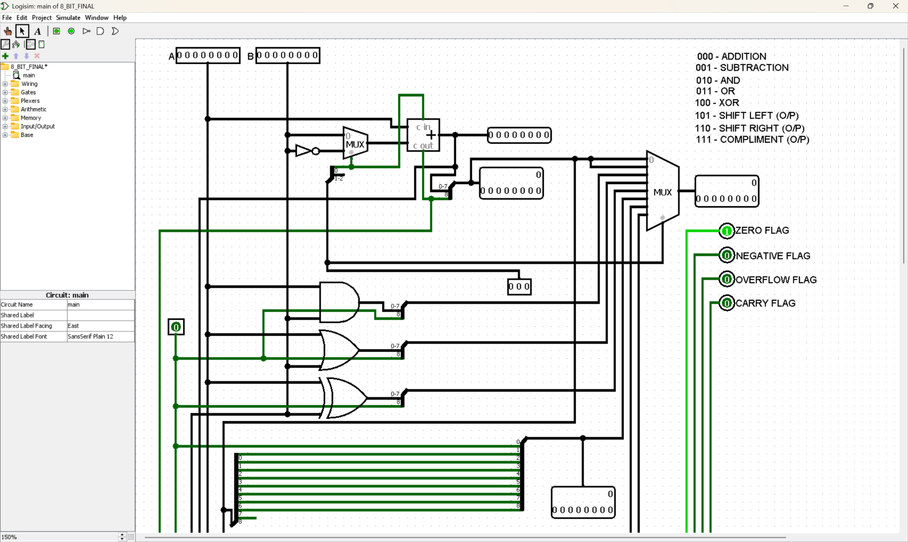
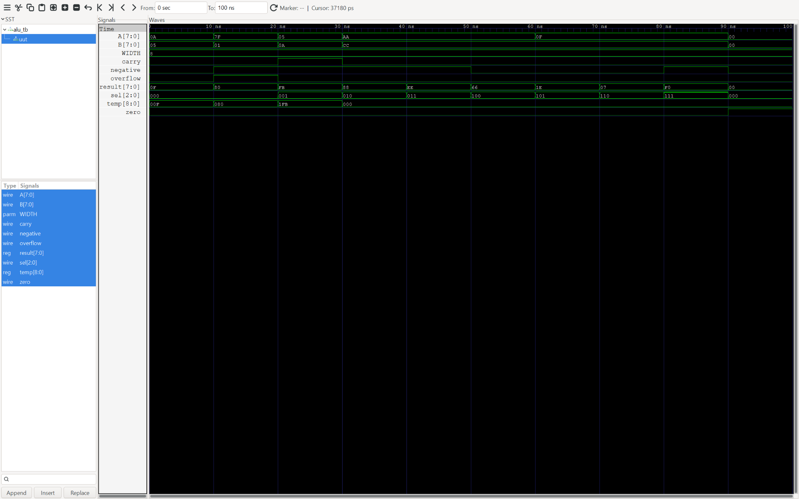

# 8-bit ALU (Verilog)

## Overview
This project implements an **8-bit Arithmetic Logic Unit (ALU)** in Verilog supporting arithmetic, logical, and shift operations with full flag generation.

The design is verified using a testbench and GTKWave waveform analysis.

---

## Datapath

---

## Operations Supported
- ADD  
- SUB (using 2’s complement)  
- AND, OR, XOR  
- Shift Left / Shift Right  
- Complement  

---

## Flag Logic
- **Zero (Z):** Result equals 0  
- **Negative (N):** MSB of result (signed output)  
- **Carry (C):** Carry-out from addition  
- **Overflow (V):** Signed overflow detection  

---

## Design Approach
- Parallel computation of all operations  
- Output selected using a **MUX-based datapath**  
- Subtraction implemented via **2’s complement addition**  
- Flags derived directly from ALU output and carry logic  

---

## Verification
The ALU is tested using a Verilog testbench and visualized in GTKWave.

---

## Example Test Cases

| A   | B   | Operation | Result | Flags |
|-----|-----|----------|--------|-------|
| 7F  | 01  | ADD      | 80     | V=1   |
| 05  | 0A  | SUB      | FB     | N=1   |
| AA  | CC  | AND      | 88     | -     |
| 0F  | -   | SHL      | 1E     | C=0   |

---

## Repository Structure
